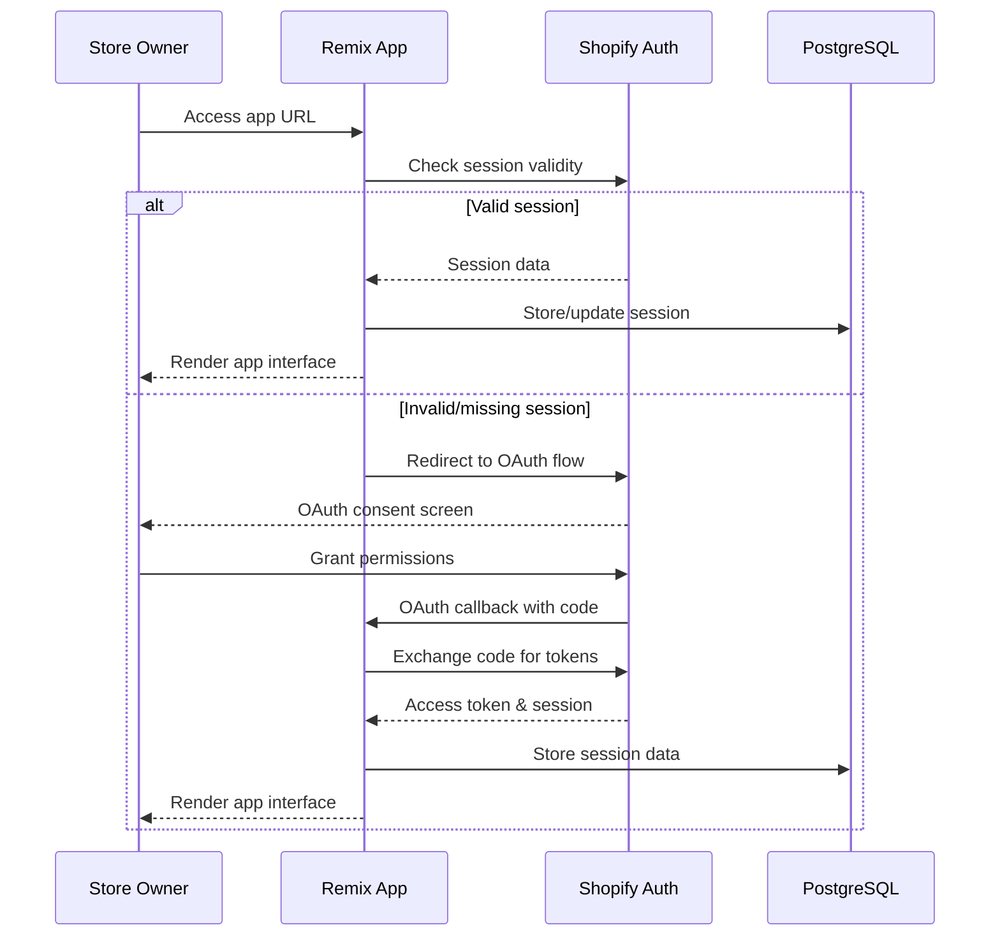

# Backend Architecture

The backend architecture defines service organization, database access patterns, and authentication implementation optimized for your dedicated server infrastructure and Shopify app requirements.

### Service Architecture

Based on the self-hosted server choice, the architecture uses Remix server routes with supporting service classes rather than separate microservices.

#### Controller/Route Organization

```
app/routes/
├── api/                            # API routes for frontend consumption
│   ├── campaigns.tsx              # Campaign CRUD operations
│   ├── campaigns.$id.tsx          # Individual campaign management
│   ├── campaigns.$id.rollback.tsx # Campaign rollback operations
│   ├── pricing-jobs.tsx           # Manual pricing job operations
│   ├── pricing-jobs.$id.tsx       # Job details and results
│   ├── webhooks.inventory.tsx     # Shopify webhook processing
│   └── audit-trail.tsx            # Audit log queries
├── app/                           # User-facing pages
│   ├── _index.tsx                 # Dashboard
│   ├── pricing-job.tsx            # Manual pricing interface
│   ├── campaigns._index.tsx       # Campaign list
│   ├── campaigns.create.tsx       # Campaign creation
│   └── campaigns.$id.tsx          # Campaign monitoring
└── webhooks/                      # External webhook endpoints
    └── inventory.tsx              # Shopify inventory webhooks
```

#### Controller Template

```typescript
// app/routes/api/campaigns.tsx
import type { ActionFunctionArgs, LoaderFunctionArgs } from '@remix-run/node';
import { json } from '@remix-run/node';
import { authenticate } from '~/shopify.server';
import { CampaignService } from '~/services/campaign-service.server';
import { AuditLogger } from '~/services/audit-logger.server';

export async function loader({ request }: LoaderFunctionArgs) {
  const { session } = await authenticate.admin(request);
  
  const url = new URL(request.url);
  const status = url.searchParams.get('status');
  const limit = parseInt(url.searchParams.get('limit') || '20');
  
  const campaignService = new CampaignService(session.shop);
  const campaigns = await campaignService.list({ status, limit });
  
  return json({ campaigns });
}

export async function action({ request }: ActionFunctionArgs) {
  const { admin, session } = await authenticate.admin(request);
  
  if (request.method === 'POST') {
    const data = await request.json();
    
    try {
      const campaignService = new CampaignService(session.shop);
      const auditLogger = new AuditLogger(session.shop);
      
      const campaign = await campaignService.create(data, session.user?.id);
      
      await auditLogger.log({
        entityType: 'campaign',
        entityId: campaign.id,
        changeType: 'created',
        triggerReason: 'Manual campaign creation',
        userId: session.user?.id,
        metadata: { campaignName: campaign.name }
      });
      
      return json({ campaign }, { status: 201 });
    } catch (error) {
      return json(
        { error: error.message }, 
        { status: 400 }
      );
    }
  }
  
  return json({ error: 'Method not allowed' }, { status: 405 });
}
```

### Database Architecture

#### Data Access Layer

```typescript
// app/models/campaign.server.ts
import { prisma } from '~/db.server';
import type { Campaign, CreateCampaignData } from '~/types/campaign';

export class CampaignRepository {
  constructor(private shopId: string) {}

  async findActive(): Promise<Campaign[]> {
    return prisma.campaign.findMany({
      where: {
        shopifyShop: { shopDomain: this.shopId },
        status: 'active'
      },
      include: {
        rules: true
      },
      orderBy: { updatedAt: 'desc' }
    });
  }

  async create(data: CreateCampaignData, userId: string): Promise<Campaign> {
    return prisma.campaign.create({
      data: {
        name: data.name,
        description: data.description,
        targetProducts: data.targetProducts,
        status: 'draft',
        userId,
        shopifyShop: {
          connect: { shopDomain: this.shopId }
        },
        rules: {
          create: data.rules.map(rule => ({
            whenCondition: rule.whenCondition,
            whenValue: rule.whenValue,
            thenAction: rule.thenAction,
            thenMode: rule.thenMode,
            thenValue: rule.thenValue,
            changeCompareAt: rule.changeCompareAt,
            description: rule.description
          }))
        }
      },
      include: {
        rules: true
      }
    });
  }

  async updateStatus(id: string, status: Campaign['status']): Promise<Campaign> {
    return prisma.campaign.update({
      where: { id },
      data: { 
        status,
        updatedAt: new Date(),
        ...(status === 'active' && { lastTriggered: null, triggerCount: 0 })
      },
      include: {
        rules: true
      }
    });
  }

  async incrementTriggerCount(id: string): Promise<void> {
    await prisma.campaign.update({
      where: { id },
      data: {
        triggerCount: { increment: 1 },
        lastTriggered: new Date()
      }
    });
  }
}

// app/services/campaign-service.server.ts
import { CampaignRepository } from '~/models/campaign.server';
import { AuditRepository } from '~/models/audit.server';
import type { Campaign, CreateCampaignData } from '~/types/campaign';

export class CampaignService {
  private campaignRepo: CampaignRepository;
  private auditRepo: AuditRepository;

  constructor(shopId: string) {
    this.campaignRepo = new CampaignRepository(shopId);
    this.auditRepo = new AuditRepository(shopId);
  }

  async list(filters: { status?: string; limit: number }): Promise<Campaign[]> {
    if (filters.status) {
      return this.campaignRepo.findByStatus(filters.status, filters.limit);
    }
    return this.campaignRepo.findAll(filters.limit);
  }

  async create(data: CreateCampaignData, userId: string): Promise<Campaign> {
    // Validate pricing rules
    this.validatePricingRules(data.rules);
    
    // Validate product targeting
    await this.validateTargetProducts(data.targetProducts);
    
    const campaign = await this.campaignRepo.create(data, userId);
    
    return campaign;
  }

  async rollback(campaignId: string, userId: string): Promise<{ jobId: string }> {
    // Get all audit entries for this campaign
    const auditEntries = await this.auditRepo.findByCampaign(campaignId);
    
    // Create rollback pricing job
    const rollbackJob = await this.createRollbackJob(auditEntries, userId);
    
    // Queue rollback processing
    await this.queueRollbackProcessing(rollbackJob.id);
    
    return { jobId: rollbackJob.id };
  }

  private validatePricingRules(rules: PricingRule[]): void {
    if (!rules.length) {
      throw new Error('At least one pricing rule is required');
    }

    for (const rule of rules) {
      if (parseFloat(rule.whenValue) < 0 || parseFloat(rule.thenValue) < 0) {
        throw new Error('Rule values must be positive numbers');
      }
      
      if (rule.thenMode === 'percentage' && parseFloat(rule.thenValue) > 100) {
        throw new Error('Percentage adjustments cannot exceed 100%');
      }
    }
  }
}
```

### Authentication and Authorization

#### Auth Flow



#### Middleware/Guards

```typescript
// app/lib/auth.server.ts
import { authenticate } from '~/shopify.server';
import type { LoaderFunctionArgs, ActionFunctionArgs } from '@remix-run/node';
import { redirect } from '@remix-run/node';

export async function requireAuth(request: Request) {
  try {
    const { admin, session } = await authenticate.admin(request);
    return { admin, session };
  } catch (error) {
    throw redirect('/auth/login');
  }
}

export async function requireActiveShop(request: Request) {
  const { session } = await requireAuth(request);
  
  if (!session.shop) {
    throw redirect('/auth/install');
  }
  
  return session;
}

// app/lib/permissions.server.ts
export class PermissionService {
  constructor(private session: SessionData) {}

  canManageCampaigns(): boolean {
    return this.hasScope('write_products') && this.hasScope('write_inventory');
  }

  canViewAuditTrail(): boolean {
    return this.hasScope('read_products');
  }

  canRollbackCampaign(): boolean {
    return this.canManageCampaigns() && this.isShopOwner();
  }

  private hasScope(scope: string): boolean {
    return this.session.scope?.includes(scope) || false;
  }

  private isShopOwner(): boolean {
    // Implementation depends on shop owner identification logic
    return this.session.user?.role === 'owner';
  }
}

// Usage in route
export async function loader({ request }: LoaderFunctionArgs) {
  const session = await requireActiveShop(request);
  const permissions = new PermissionService(session);
  
  if (!permissions.canViewAuditTrail()) {
    throw new Response('Forbidden', { status: 403 });
  }
  
  // Continue with route logic...
}
```

