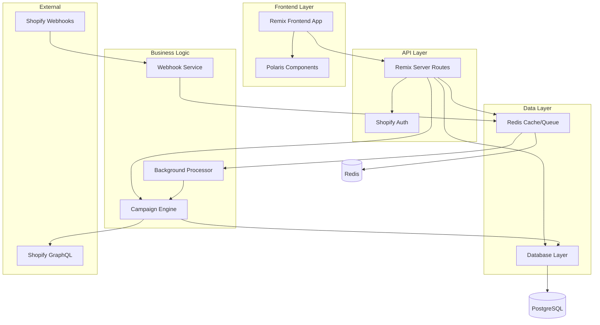

# Components

Based on the architectural patterns, tech stack, and data models, I've identified the major logical components across the fullstack that will handle campaign automation, manual pricing jobs, and real-time webhook processing.

### Remix Frontend App

**Responsibility:** Main user interface for campaign management and manual pricing operations, embedded within Shopify Admin using App Bridge and Polaris components.

**Key Interfaces:**
- `/app/dashboard` - Campaign overview and recent activity
- `/app/pricing-job` - Enhanced manual pricing interface
- `/app/campaigns` - Campaign creation and management
- `/app/campaigns/:id` - Campaign details and monitoring

**Dependencies:** Shopify App Bridge, Polaris UI components, Remix server routes for data fetching

**Technology Stack:** React 18.2.0, Remix 2.16.1, TypeScript 5.2.2, Shopify Polaris 12.0.0

### Remix Server Routes

**Responsibility:** API endpoints, form handling, authentication, and server-side business logic. Handles both manual pricing operations and campaign management.

**Key Interfaces:**
- `POST /api/campaigns` - Campaign CRUD operations
- `POST /api/pricing-jobs` - Manual pricing job execution
- `POST /api/webhooks/inventory` - Webhook processing endpoint
- `GET /api/audit-trail` - Audit log queries

**Dependencies:** PostgreSQL database, Redis job queue, Shopify Admin GraphQL API

**Technology Stack:** Remix server routes, Prisma ORM, Shopify GraphQL client

### Campaign Engine

**Responsibility:** Core business logic for evaluating pricing rules, processing inventory changes, and executing automated price updates based on webhook triggers.

**Key Interfaces:**
- `evaluateRules(inventory, rules)` - Rule evaluation engine
- `executePriceUpdates(variants, changes)` - Price update orchestration
- `createAuditTrail(changes)` - Audit logging interface

**Dependencies:** Shopify Admin GraphQL API, PostgreSQL audit tables, Redis job coordination

**Technology Stack:** Node.js background service, Shopify GraphQL mutations, PostgreSQL transactions

### Webhook Processing Service

**Responsibility:** Receives Shopify inventory webhooks, validates payload authenticity, queues processing jobs, and triggers campaign evaluation for affected products.

**Key Interfaces:**
- `POST /webhooks/inventory` - Shopify webhook receiver
- `validateWebhookSignature(payload, signature)` - Security validation
- `queueCampaignEvaluation(inventoryChange)` - Job queuing

**Dependencies:** Redis job queue, Campaign Engine, webhook signature verification

**Technology Stack:** Express.js microservice, Redis Bull queue, crypto signature validation

### Database Layer

**Responsibility:** Data persistence for campaigns, pricing jobs, audit trails, and session storage. Optimized for complex queries and audit compliance requirements.

**Key Interfaces:**
- Campaign repository with rule queries
- Audit trail repository with time-range queries
- Pricing job repository with result aggregation
- Session storage for Shopify authentication

**Dependencies:** PostgreSQL 15+, connection pooling, backup strategies

**Technology Stack:** PostgreSQL with Prisma ORM, Redis for caching frequent queries

### Shopify Integration Layer

**Responsibility:** Abstracts all Shopify Admin API interactions, handles rate limiting, manages GraphQL queries/mutations, and processes webhook authentication.

**Key Interfaces:**
- `getProductVariants(productIds)` - Product data fetching
- `updateVariantPrices(variants, prices)` - Batch price updates
- `queryInventoryLevels(locationId)` - Inventory monitoring
- `validateWebhookAuth(signature, payload)` - Webhook security

**Dependencies:** Shopify Admin GraphQL API, rate limiting (40 calls/second), authentication tokens

**Technology Stack:** Shopify App Remix client, GraphQL query builders, retry logic for API limits

### Background Job Processor

**Responsibility:** Processes queued jobs for campaign execution, price updates, audit trail generation, and system maintenance tasks like reconciliation sweeps.

**Key Interfaces:**
- Redis job consumption and processing
- Error handling and retry logic
- Dead letter queue management
- Job status reporting

**Dependencies:** Redis Bull queues, Campaign Engine, error logging

**Technology Stack:** Node.js worker processes, Redis queue management, Winston logging

### Component Diagrams


