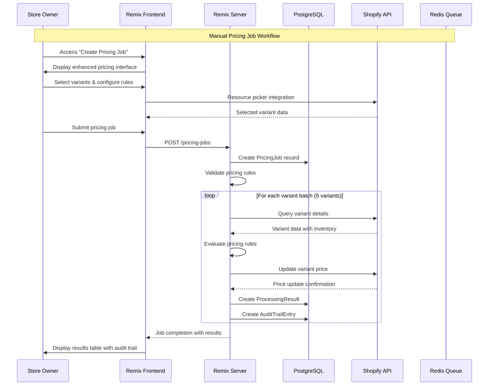
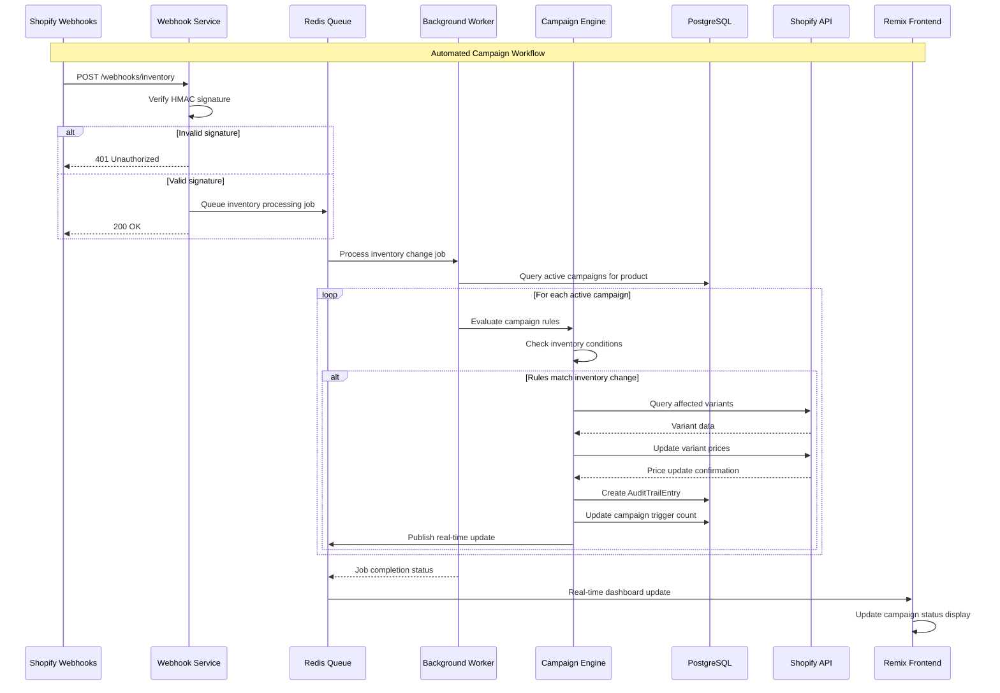
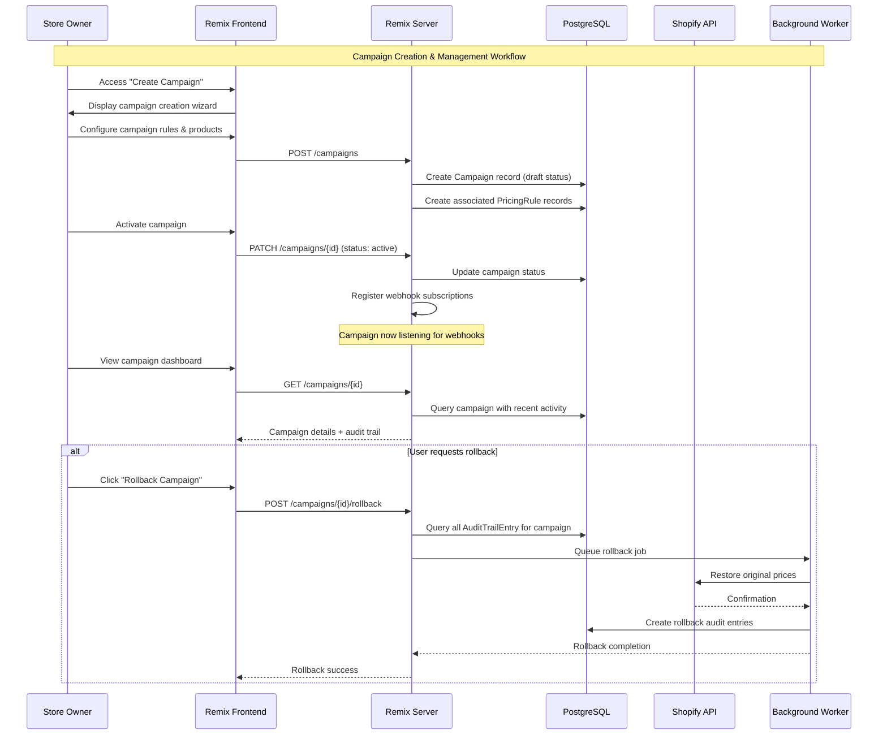
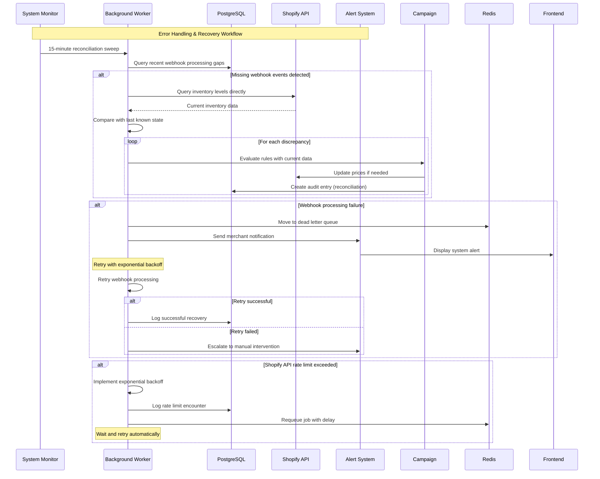

# Core Workflows

The following sequence diagrams illustrate key system workflows including both frontend user interactions and backend webhook processing, showing component interactions and error handling paths.


