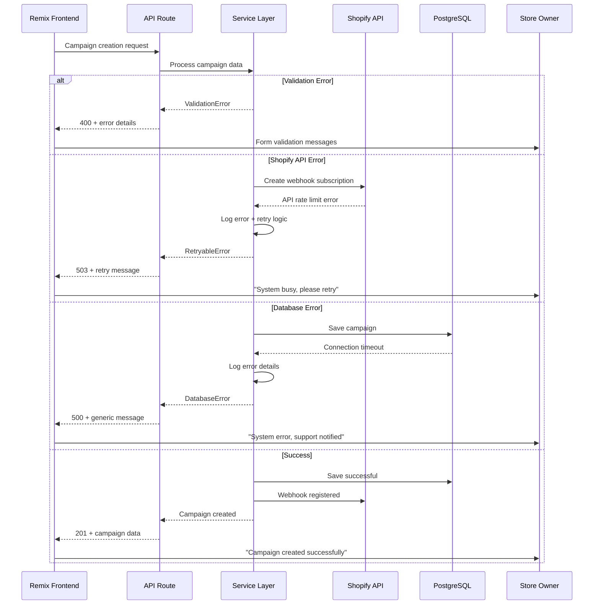

# Error Handling Strategy

The unified error handling strategy ensures consistent error management across frontend components and backend services, with specific focus on Shopify API integration and campaign processing reliability.

### Error Flow



### Error Response Format

```typescript
interface ApiError {
  error: {
    code: string;
    message: string;
    details?: Record<string, any>;
    timestamp: string;
    requestId: string;
  };
}
```

### Frontend Error Handling

```typescript
// app/lib/error-handler.client.ts
import { toast } from '@shopify/polaris';

export class FrontendErrorHandler {
  static handle(error: ApiError, context?: string): void {
    const { code, message } = error.error;
    
    switch (code) {
      case 'VALIDATION_ERROR':
        // Handle form validation errors
        this.handleValidationError(error, context);
        break;
      
      case 'SHOPIFY_API_ERROR':
        // Handle Shopify API issues
        this.handleShopifyError(error);
        break;
      
      case 'RATE_LIMIT_ERROR':
        // Handle rate limiting
        this.handleRateLimitError(error);
        break;
      
      case 'WEBHOOK_ERROR':
        // Handle webhook processing issues
        this.handleWebhookError(error);
        break;
      
      default:
        // Generic error handling
        this.handleGenericError(error);
    }
    
    // Log error for debugging
    console.error(`[${context || 'Unknown'}] Error:`, error);
  }
  
  private static handleValidationError(error: ApiError, context?: string): void {
    // Display specific validation messages
    if (context === 'campaign-form') {
      // Form-specific error handling
      const details = error.error.details || {};
      Object.entries(details).forEach(([field, message]) => {
        toast.error(`${field}: ${message}`);
      });
    } else {
      toast.error(error.error.message);
    }
  }
  
  private static handleShopifyError(error: ApiError): void {
    const message = 'Unable to connect to Shopify. Please check your permissions and try again.';
    toast.error(message);
    
    // Suggest specific actions based on error details
    if (error.error.details?.missingScopes) {
      toast.error('Additional permissions required. Please reinstall the app.');
    }
  }
  
  private static handleRateLimitError(error: ApiError): void {
    toast.error('System is busy processing requests. Please wait a moment and try again.');
    
    // Implement exponential backoff for retries
    const retryAfter = error.error.details?.retryAfter || 5000;
    setTimeout(() => {
      toast.success('You can try your request again now.');
    }, retryAfter);
  }
  
  private static handleWebhookError(error: ApiError): void {
    toast.error('Campaign automation temporarily unavailable. Manual pricing still works.');
    
    // Provide fallback options
    const fallbackMessage = 'You can still create manual pricing jobs while we resolve this issue.';
    toast.success(fallbackMessage);
  }
  
  private static handleGenericError(error: ApiError): void {
    toast.error('An unexpected error occurred. Our team has been notified.');
    
    // Provide helpful context
    if (error.error.requestId) {
      toast.success(`Reference ID: ${error.error.requestId} for support inquiries.`);
    }
  }
}

// Usage in components
export function useCampaignForm() {
  const [errors, setErrors] = useState<Record<string, string>>({});
  
  const handleSubmit = async (data: CampaignFormData) => {
    try {
      const campaign = await apiClient.campaigns.create(data);
      toast.success('Campaign created successfully!');
      return campaign;
    } catch (error) {
      FrontendErrorHandler.handle(error as ApiError, 'campaign-form');
      
      // Set form-specific errors
      if (error.error.code === 'VALIDATION_ERROR') {
        setErrors(error.error.details || {});
      }
    }
  };
  
  return { handleSubmit, errors };
}
```

### Backend Error Handling

```typescript
// app/lib/error-handler.server.ts
import { json } from '@remix-run/node';
import { v4 as uuidv4 } from 'uuid';
import { logger } from './logger.server';

export enum ErrorCode {
  VALIDATION_ERROR = 'VALIDATION_ERROR',
  SHOPIFY_API_ERROR = 'SHOPIFY_API_ERROR',
  DATABASE_ERROR = 'DATABASE_ERROR',
  RATE_LIMIT_ERROR = 'RATE_LIMIT_ERROR',
  WEBHOOK_ERROR = 'WEBHOOK_ERROR',
  UNAUTHORIZED = 'UNAUTHORIZED',
  FORBIDDEN = 'FORBIDDEN',
  NOT_FOUND = 'NOT_FOUND',
  INTERNAL_ERROR = 'INTERNAL_ERROR'
}

export class AppError extends Error {
  constructor(
    public code: ErrorCode,
    message: string,
    public statusCode: number = 500,
    public details?: Record<string, any>
  ) {
    super(message);
    this.name = 'AppError';
  }
}

export class BackendErrorHandler {
  static handle(error: unknown, context?: string): Response {
    const requestId = uuidv4();
    
    // Log error with context
    logger.error('Request error', {
      requestId,
      context,
      error: error instanceof Error ? {
        name: error.name,
        message: error.message,
        stack: error.stack
      } : error
    });
    
    if (error instanceof AppError) {
      return this.handleAppError(error, requestId);
    }
    
    if (error instanceof Error) {
      return this.handleUnknownError(error, requestId);
    }
    
    return this.handleGenericError(requestId);
  }
  
  private static handleAppError(error: AppError, requestId: string): Response {
    const errorResponse = {
      error: {
        code: error.code,
        message: this.getPublicMessage(error),
        details: error.details,
        timestamp: new Date().toISOString(),
        requestId
      }
    };
    
    return json(errorResponse, { status: error.statusCode });
  }
  
  private static handleUnknownError(error: Error, requestId: string): Response {
    // Don't expose internal error details to client
    const errorResponse = {
      error: {
        code: ErrorCode.INTERNAL_ERROR,
        message: 'An internal error occurred. Please try again later.',
        timestamp: new Date().toISOString(),
        requestId
      }
    };
    
    return json(errorResponse, { status: 500 });
  }
  
  private static handleGenericError(requestId: string): Response {
    const errorResponse = {
      error: {
        code: ErrorCode.INTERNAL_ERROR,
        message: 'An unexpected error occurred.',
        timestamp: new Date().toISOString(),
        requestId
      }
    };
    
    return json(errorResponse, { status: 500 });
  }
  
  private static getPublicMessage(error: AppError): string {
    // Return user-friendly messages
    switch (error.code) {
      case ErrorCode.VALIDATION_ERROR:
        return error.message; // Validation messages are safe to expose
      case ErrorCode.SHOPIFY_API_ERROR:
        return 'Unable to connect to Shopify. Please check your permissions.';
      case ErrorCode.RATE_LIMIT_ERROR:
        return 'Too many requests. Please wait a moment and try again.';
      case ErrorCode.WEBHOOK_ERROR:
        return 'Webhook processing failed. Campaign automation may be delayed.';
      case ErrorCode.UNAUTHORIZED:
        return 'Authentication required. Please log in again.';
      case ErrorCode.FORBIDDEN:
        return 'You do not have permission to perform this action.';
      case ErrorCode.NOT_FOUND:
        return 'The requested resource was not found.';
      default:
        return 'An error occurred. Please try again later.';
    }
  }
}

// Usage in routes
export async function action({ request }: ActionFunctionArgs) {
  try {
    const { session } = await authenticate.admin(request);
    const data = await request.json();
    
    const campaignService = new CampaignService(session.shop);
    const campaign = await campaignService.create(data, session.user?.id);
    
    return json({ campaign }, { status: 201 });
  } catch (error) {
    return BackendErrorHandler.handle(error, 'create-campaign');
  }
}

// Service layer error throwing
export class CampaignService {
  async create(data: CreateCampaignData, userId: string): Promise<Campaign> {
    // Validation
    if (!data.name || data.name.trim().length === 0) {
      throw new AppError(
        ErrorCode.VALIDATION_ERROR,
        'Campaign name is required',
        400,
        { field: 'name', message: 'Campaign name cannot be empty' }
      );
    }
    
    if (!data.rules || data.rules.length === 0) {
      throw new AppError(
        ErrorCode.VALIDATION_ERROR,
        'At least one pricing rule is required',
        400,
        { field: 'rules', message: 'Campaign must have at least one pricing rule' }
      );
    }
    
    try {
      // Database operation
      const campaign = await this.campaignRepo.create(data, userId);
      
      // Shopify webhook registration
      await this.registerWebhooks(campaign.id, data.targetProducts);
      
      return campaign;
    } catch (error) {
      if (error.code === 'P2002') { // Prisma unique constraint
        throw new AppError(
          ErrorCode.VALIDATION_ERROR,
          'A campaign with this name already exists',
          400,
          { field: 'name', message: 'Campaign name must be unique' }
        );
      }
      
      if (error.message?.includes('rate limit')) {
        throw new AppError(
          ErrorCode.RATE_LIMIT_ERROR,
          'API rate limit exceeded',
          503,
          { retryAfter: 5000 }
        );
      }
      
      // Database connection errors
      if (error.code === 'ECONNREFUSED') {
        throw new AppError(
          ErrorCode.DATABASE_ERROR,
          'Database connection failed',
          503
        );
      }
      
      // Re-throw unknown errors to be handled by global handler
      throw error;
    }
  }
}
```

