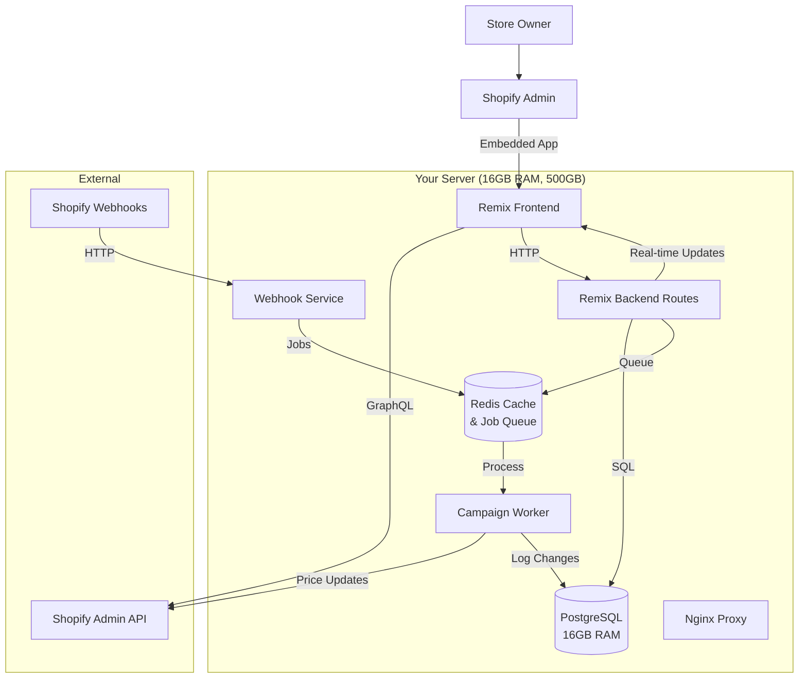

# High Level Architecture

### Technical Summary

This is a **Shopify embedded app** using Remix fullstack framework with Polaris UI, transforming from a single-page manual pricing tool into a comprehensive campaign automation platform. The architecture leverages **PostgreSQL for data persistence**, **Shopify webhooks for real-time inventory monitoring**, and **multi-page navigation** for enhanced user experience. Key integration points include Shopify Admin GraphQL API for product management, webhook processing for automated campaign triggers, and audit trail systems for compliance and rollback capabilities. The platform choice emphasizes **developer productivity** while maintaining enterprise-grade reliability for high-volume Shopify stores processing 30-50+ orders during peak periods.

### Platform and Infrastructure Choice

**Platform:** Your Dedicated Server  
**Key Services:** PostgreSQL, Redis (caching/queues), Nginx (reverse proxy), Docker  
**Deployment Host and Regions:** Your server location + CDN if needed  

**Recommendation: Your Dedicated Server with Docker Stack**
- PostgreSQL + Redis on your server (16GB RAM is excellent for this workload)
- Shopify app can be hosted on your server or Shopify hosting (depends on compliance needs)
- 500GB storage perfect for extensive audit trails and campaign history
- Docker Compose for easy deployment and management

### Repository Structure

**Structure:** Monorepo with Docker services  
**Monorepo Tool:** npm workspaces + Docker Compose  
**Package Organization:** Service-oriented with infrastructure as code  

```
hc-pricing-auto/
├── app/                    # Main Remix application
├── packages/
│   ├── shared/            # Shared types and utilities
│   ├── webhook-processor/ # Isolated webhook handling service
│   └── audit-logger/      # Audit trail system
├── infrastructure/
│   ├── docker-compose.yml # Full stack deployment
│   ├── nginx/             # Reverse proxy config
│   ├── postgres/          # Database init scripts
│   └── redis/             # Cache configuration
├── scripts/
│   ├── deploy.sh          # Deployment automation
│   └── backup.sh          # Database backup script
└── docs/
```

### High Level Architecture Diagram



### Architectural Patterns

- **Jamstack + Server Actions:** Static-generated admin interface with server-side campaign processing - _Rationale:_ Optimal performance for Shopify admin embedding while maintaining real-time capabilities
- **Event-Driven Architecture:** Webhook-triggered campaign execution with audit logging - _Rationale:_ Enables real-time automation while maintaining system reliability and compliance requirements  
- **Repository Pattern:** Abstract database operations for campaigns and audit trails - _Rationale:_ Facilitates testing and future scaling of data storage solutions
- **Command Query Separation:** Separate read/write operations for campaign management - _Rationale:_ Optimizes performance for dashboard queries while ensuring data consistency for pricing updates
- **Embedded App Pattern:** Full Shopify App Bridge integration with Polaris components - _Rationale:_ Maintains native Shopify admin experience and leverages existing merchant workflows

