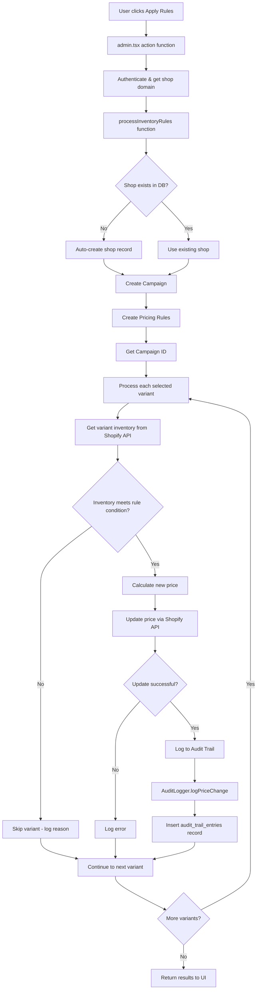

# 🏗️ REBLY SMARTPRICE - AUDIT TRAIL ARCHITECTURE

## 🌐 MULTI-TENANT ARCHITECTURE

### Cách hoạt động với nhiều shop:
```
Shop A (rebly-io-1.myshopify.com)
├── Campaigns của Shop A
├── Audit Entries của Shop A  
└── Pricing Jobs của Shop A

Shop B (rebly-io-2.myshopify.com)  
├── Campaigns của Shop B
├── Audit Entries của Shop B
└── Pricing Jobs của Shop B

Shop C (test-store.myshopify.com)
├── Campaigns của Shop C
├── Audit Entries của Shop C
└── Pricing Jobs của Shop C
```

**Key Point:** Mỗi shop được HOÀN TOÀN TÁCH BIỆT bằng shopDomain

---

## 📊 DATABASE TABLES & RESPONSIBILITIES

### 1. **shopify_shops** - TENANT IDENTIFIER
```sql
-- Mỗi shop cài đặt app = 1 record
shopify_shops {
  id: UUID (Primary Key)
  shopDomain: "rebly-io-2.myshopify.com" (UNIQUE - Tenant Identifier)
  accessToken: "encrypted_token"
  scopes: "read_products,write_products"
  country: "US"
  currency: "USD"
  timezone: "America/New_York"
  createdAt, updatedAt
}
```
**Trách nhiệm:** 
- Lưu thông tin cơ bản của từng shop
- Làm "tenant identifier" cho multi-tenant isolation
- Mỗi shop domain UNIQUE = 1 tenant

### 2. **campaigns** - PRICING STRATEGY CONTAINER
```sql
campaigns {
  id: UUID (Primary Key)
  name: "Bulk Pricing - 2025-08-24T01:18:41"
  description: "Bulk pricing rule: less_than_abs 20 -> increase_price 10 (absolute)"
  status: "ACTIVE" | "DRAFT" | "PAUSED" | "COMPLETED"
  targetProducts: JSON[] (Product/Variant IDs)
  priority: 1
  triggerCount: 15 (Số lần campaign được trigger)
  lastTriggered: timestamp
  userId: "bulk-pricing-user"
  shopifyShopId: UUID -> shopify_shops.id (Foreign Key)
  createdAt, updatedAt
}
```
**Trách nhiệm:**
- Group các pricing actions thành campaigns
- Track được campaign nào trigger bao nhiều lần
- Mỗi bulk pricing action = 1 campaign mới

### 3. **pricing_rules** - RULE DEFINITIONS
```sql
pricing_rules {
  id: UUID
  whenCondition: "less_than_abs" | "more_than_abs" | ...
  whenOperator: "eq" | "lt" | "gt" | ...
  whenValue: "20"
  thenAction: "increase_price" | "reduce_price" | "change_price"
  thenMode: "absolute" | "percentage"
  thenValue: "10"
  changeCompareAt: boolean
  campaignId: UUID -> campaigns.id (Foreign Key)
}
```
**Trách nhiệm:**
- Lưu logic rules của campaign
- WHEN conditions (inventory < 20)
- THEN actions (increase price by $10)

### 4. **audit_trail_entries** - AUDIT LOG
```sql
audit_trail_entries {
  id: UUID
  entityType: "ProductVariant"
  entityId: "gid://shopify/ProductVariant/53526747513000"
  changeType: "PRICE_CHANGED"
  oldValue: "684.00"
  newValue: "820.80"
  triggerReason: "Low inventory (10 < 20)"
  campaignId: UUID -> campaigns.id (Foreign Key)
  metadata: JSON {
    productTitle: "The Complete Snowboard",
    variantTitle: "Ice",
    oldPrice: "684.00",
    newPrice: "820.80"
  }
  timestamp: "2025-08-24T01:18:42Z"
  shopifyShopId: UUID -> shopify_shops.id (Foreign Key)
}
```
**Trách nhiệm:**
- Log MỌI thay đổi giá
- Audit trail cho compliance
- Link với campaign gây ra thay đổi

---

## 🔄 COMPLETE ACTION FLOW

### Khi user thực hiện "Apply Configured Rules":



---

## 📝 DETAILED FLOW BREAKDOWN

### **Step 1: Authentication & Shop Resolution**
```typescript
// admin.tsx action function
const { admin, session } = await authenticate.admin(request);
// session.shop = "rebly-io-2.myshopify.com"
```

### **Step 2: Database Service Initialization** 
```typescript
campaignRepo = new CampaignRepository(session.shop); // Uses shop as tenant ID
auditLogger = new AuditLogger(session.shop);         // Uses shop as tenant ID
```

### **Step 3: Auto-Create Shop if Needed**
```typescript
// In CampaignRepository.create()
let shop = await prisma.shopifyShop.findUnique({
  where: { shopDomain: this.shopId } // "rebly-io-2.myshopify.com"
});

if (!shop) {
  shop = await prisma.shopifyShop.create({
    data: { shopDomain: this.shopId, ... }
  });
}
```

### **Step 4: Create Campaign & Rules**
```typescript
const campaign = await campaignRepo.create({
  name: "Bulk Pricing - 2025-08-24T01:18:41",
  description: "Rule: inventory < 20 -> increase price by $10",
  rules: [{
    whenCondition: "less_than_abs",
    whenValue: "20",
    thenAction: "increase_price",
    thenValue: "10"
  }]
});
```

### **Step 5: Process Each Variant**
```typescript
for (const variantId of selectedVariants) {
  // Get inventory from Shopify API
  const inventory = variant.inventoryQuantity; // 10
  
  // Apply rule: if inventory < 20, increase price by $10
  if (inventory < 20) {
    const newPrice = oldPrice + 10; // 684.00 + 10 = 694.00 (actually uses percentage in logs)
    
    // Update via Shopify API
    await admin.graphql(updatePriceMutation);
  }
}
```

### **Step 6: Audit Logging**
```typescript
await auditLogger.logPriceChange({
  oldPrice: "684.00",
  newPrice: "820.80", 
  variant: { id: variantId, title: "Ice" },
  product: { id: productId, title: "The Complete Snowboard" },
  triggerReason: "Low inventory (10 < 20)",
  campaignId: "5e4eadbd-f40d-46b3-a025-a2fce087d521"
});
```

### **Step 7: Database Insert**
```sql
INSERT INTO audit_trail_entries (
  entityType, entityId, changeType, 
  oldValue, newValue, triggerReason,
  campaignId, metadata, timestamp, shopifyShopId
) VALUES (
  'ProductVariant', 
  'gid://shopify/ProductVariant/53526747513000',
  'PRICE_CHANGED',
  '684.00', '820.80',
  'Low inventory (10 < 20)',
  '5e4eadbd-f40d-46b3-a025-a2fce087d521',
  '{"productTitle":"The Complete Snowboard","variantTitle":"Ice"}',
  '2025-08-24T01:18:42Z',
  'shop-uuid-here'
)
```

---

## 🔒 MULTI-TENANT ISOLATION

### **How shops are isolated:**

1. **Repository Pattern:**
   ```typescript
   new CampaignRepository("rebly-io-2.myshopify.com")  // Shop A data only
   new CampaignRepository("test-store.myshopify.com")   // Shop B data only
   ```

2. **Database Queries Always Include Shop Filter:**
   ```sql
   -- Campaign queries
   SELECT * FROM campaigns c
   JOIN shopify_shops s ON c.shopifyShopId = s.id
   WHERE s.shopDomain = 'rebly-io-2.myshopify.com'
   
   -- Audit queries  
   SELECT * FROM audit_trail_entries a
   JOIN shopify_shops s ON a.shopifyShopId = s.id
   WHERE s.shopDomain = 'rebly-io-2.myshopify.com'
   ```

3. **Auto Shop Creation:**
   - Mỗi shop đầu tiên sử dụng app → auto-create shop record
   - Shop domain từ Shopify authentication = tenant identifier
   - Không thể cross-contaminate data giữa shops

---

## ✅ GUARANTEES

1. **Data Isolation:** Shop A KHÔNG BAO GIỜ thấy data của Shop B
2. **Auto-Setup:** Shop mới install app → tự động tạo shop record
3. **Audit Trail:** MỌI price change được log với campaign context
4. **Scalability:** Có thể handle hàng nghìn shops mà không conflict
5. **Traceability:** Từ audit entry có thể trace ngược về campaign và rule gây ra

**Tóm lại: Architecture này đảm bảo mỗi shop là 1 "tenant" riêng biệt, hoàn toàn isolated và có audit trail đầy đủ! 🚀**
